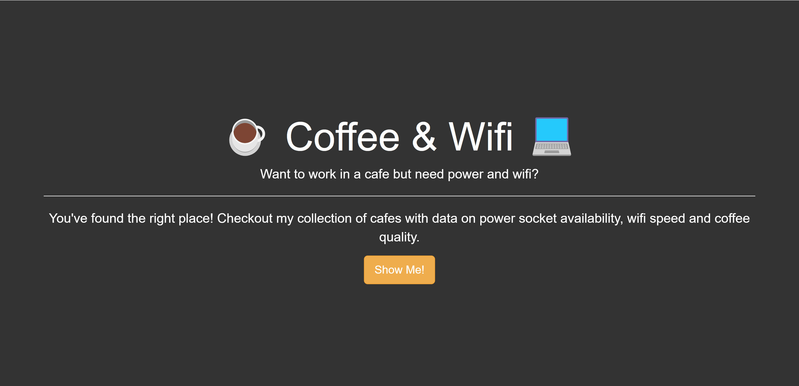
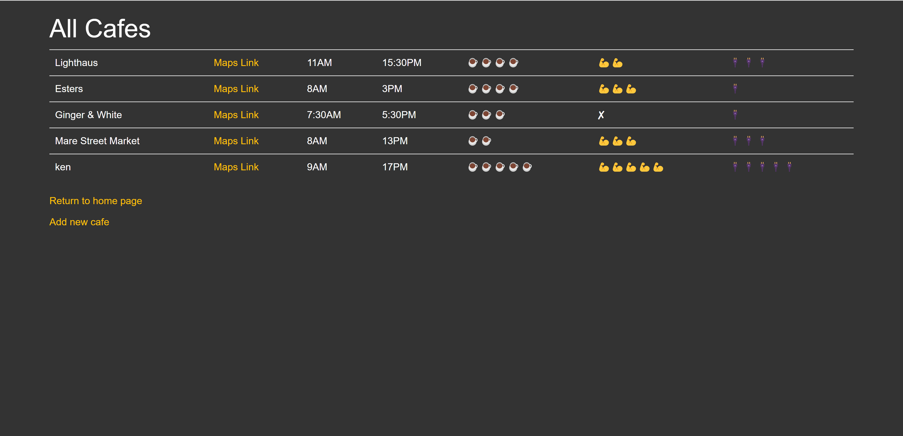
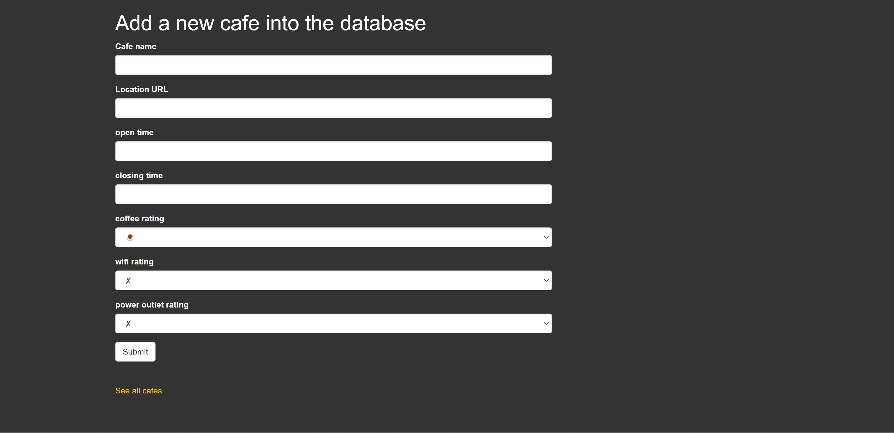

# Cafe and WiFi Website
This is a website for a cafe that offers free WiFi to customers. The website allows users to view the cafe's menu, hours, and location, and also provides a way for them to connect to the WiFi network.

# Features

The website includes the following features:

- Home page: Displays a welcome message and links to the other pages.

- Cafe page: Displays the cafe's menu, including categories and items.

- Add cafe page: Displays the cafe's hours of operation.

# Dependencies
The website requires the following dependencies to be installed:

Flask
- Flask-WTF
- WTForms
- Flask-Bootstrap

# Getting Started
To get started with the website, follow these steps:

1. Install the dependencies using `pip install -r requirements.txt`.
2. Run the app with `python app.py`.
3. Open the website by visiting http://localhost:5000 in your web browser.
Contributing

